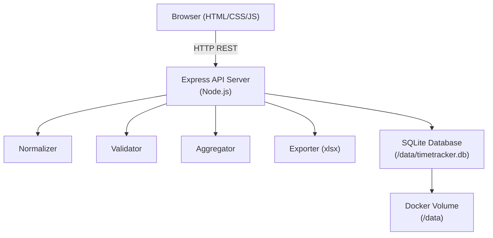

# Design Document: Time Tracker

## Overview

The Time Tracker is a single-user, locally hosted web application for recording and reviewing work hours by project. It runs entirely inside a Docker container with no external dependencies. The architecture follows a classic client-server split: a lightweight backend API (Node.js + Express) persists data to a SQLite database mounted on a Docker volume, and a vanilla HTML/CSS/JavaScript frontend communicates with the API over HTTP.

The application is intentionally minimal. There is no authentication, no multi-user support, and no cloud connectivity. All business logic (normalization, validation, aggregation, export) lives in the backend so the frontend remains a thin presentation layer.

### Key Design Goals

- **Zero external dependencies at runtime** — SQLite is embedded; no separate database process.
- **Single-command startup** — `docker compose up` is the only required command.
- **Data durability** — the SQLite file lives on a named Docker volume; container restarts are transparent.
- **Clean separation** — frontend talks only to the REST API; all data rules are enforced server-side.

---

## Architecture



### Container Layout

A single Docker container runs both the Express server (serving static frontend files and the REST API) on port **3000**. The SQLite database file is stored at `/data/timetracker.db` inside the container, backed by a named Docker volume.

```
TimeTracker/
├── Dockerfile
├── docker-compose.yml
├── package.json
├── server/
│   ├── index.js            # Express entry point
│   ├── db.js               # SQLite connection + schema init
│   ├── routes/
│   │   ├── entries.js      # POST /workday, GET/PUT/DELETE /entries
│   │   ├── projects.js     # GET /projects
│   │   └── export.js       # GET /export
│   └── lib/
│       ├── normalizer.js   # Time rounding, project name normalization
│       ├── validator.js    # Duration + overlap validation
│       ├── aggregator.js   # Hours aggregation + rounding
│       └── exporter.js     # xlsx generation
└── public/
    ├── index.html          # Main page
    ├── summary.html        # Summary view
    ├── export.html         # Export UI
    └── js/
        ├── main.js         # Main page logic + Add Workday modal
        ├── summary.js      # Summary view logic
        └── export.js       # Export UI logic
```

---

## Components and Interfaces

### Backend Components

#### Normalizer (`server/lib/normalizer.js`)

Responsible for sanitizing inputs before validation or persistence.

```js
// Round a time string "HH:MM" to the nearest 15-minute interval
roundToNearest15(timeStr: string): string

// Convert project name to lowercase and trim whitespace
normalizeProjectName(name: string): string
```

Rounding rule: round to the nearest quarter-hour (0, 15, 30, 45). Ties round up (e.g., 07:07 → 07:00; 07:08 → 07:15).

#### Validator (`server/lib/validator.js`)

Enforces business rules on a set of time entries for a single date.

```js
// Returns { valid: true } or { valid: false, errors: [{ row, message }] }
validateEntries(entries: Entry[]): ValidationResult

// Check a single entry has duration >= 15 minutes
checkMinDuration(entry: Entry): boolean

// Check no two entries in the array overlap
checkNoOverlap(entries: Entry[]): OverlapResult
```

Overlap detection: two entries overlap if one's start time is strictly before the other's end time AND the other's start time is strictly before the first's end time (standard interval overlap).

#### Aggregator (`server/lib/aggregator.js`)

Computes total hours per project per day.

```js
// Returns Map<projectName, totalHours> where totalHours is rounded to nearest 0.25
aggregateByProject(entries: Entry[]): Map<string, number>

// Round a decimal hours value to nearest 0.25
roundToQuarter(hours: number): number
```

#### Exporter (`server/lib/exporter.js`)

Generates the `.xlsx` file using the `exceljs` npm package.

```js
// Returns a Buffer containing the xlsx file
generateXlsx(rows: AggregatedRow[]): Buffer
```

The pivot structure: rows = dates (ascending), columns = all project names that appear in the range, cells = aggregated hours (0 if no entry for that date-project pair).

#### Database (`server/db.js`)

Initializes the SQLite schema on startup using `better-sqlite3`.

```js
// Returns the singleton db connection
getDb(): Database

// Run schema migrations / CREATE TABLE IF NOT EXISTS
initSchema(): void
```

#### API Routes

| Method | Path | Description |
|--------|------|-------------|
| `POST` | `/api/workday` | Batch-insert time entries for a date |
| `GET` | `/api/entries?date=YYYY-MM-DD` | Fetch all entries for a date |
| `PUT` | `/api/entries/:id` | Update a single entry |
| `DELETE` | `/api/entries/:id` | Delete a single entry |
| `GET` | `/api/projects` | List all distinct project names |
| `GET` | `/api/export?start=YYYY-MM-DD&end=YYYY-MM-DD` | Download xlsx export |
| `GET` | `/api/summary?start=YYYY-MM-DD&end=YYYY-MM-DD` | Aggregated summary data |

### Frontend Components

#### Main Page (`public/index.html` + `public/js/main.js`)

- Renders three navigation buttons: **Add Workday**, **View Summary**, **Export Data**.
- Manages the **Add Workday modal**: calendar date picker, dynamic entry table (add/remove rows), project name autocomplete, Done/Cancel buttons.
- On Done: POSTs to `/api/workday`; displays inline error messages on failure.

#### Daily Editor (embedded in main page modal)

- Dynamic table with columns: Project, Start Time, End Time, Remove.
- Inline editing activated per row; saves via `PUT /api/entries/:id`.
- Delete button calls `DELETE /api/entries/:id` and removes the row from the DOM.

#### Summary View (`public/summary.html` + `public/js/summary.js`)

- Fetches aggregated data from `/api/summary`.
- Renders grouped by date (descending), each date listing project → hours.

#### Export UI (`public/export.html` + `public/js/export.js`)

- Two date pickers (start, end) and an Export button.
- On Export: navigates to `/api/export?start=...&end=...` to trigger browser download.

---

## Data Models

### Database Schema

```sql
CREATE TABLE IF NOT EXISTS time_entries (
    id          INTEGER PRIMARY KEY AUTOINCREMENT,
    date        TEXT    NOT NULL,          -- ISO 8601: YYYY-MM-DD
    project     TEXT    NOT NULL,          -- lowercase, trimmed
    start_time  TEXT    NOT NULL,          -- HH:MM (24-hour)
    end_time    TEXT    NOT NULL,          -- HH:MM (24-hour)
    created_at  TEXT    NOT NULL DEFAULT (datetime('now'))
);

CREATE INDEX IF NOT EXISTS idx_entries_date    ON time_entries(date);
CREATE INDEX IF NOT EXISTS idx_entries_project ON time_entries(project);
```

No separate `projects` table is needed — distinct project names are derived from `time_entries` via `SELECT DISTINCT project`.

### API Request / Response Shapes

#### `POST /api/workday`

```json
// Request body
{
  "date": "2025-07-14",
  "entries": [
    { "project": "Alpha", "start_time": "09:00", "end_time": "11:30" },
    { "project": "Beta",  "start_time": "13:00", "end_time": "15:00" }
  ]
}

// Success 201
{ "inserted": 2 }

// Validation failure 422
{
  "errors": [
    { "row": 1, "message": "Duration must be at least 15 minutes after rounding." },
    { "row": 0, "message": "Entry overlaps with row 1." }
  ]
}
```

#### `GET /api/entries?date=YYYY-MM-DD`

```json
// Success 200
[
  { "id": 1, "date": "2025-07-14", "project": "alpha", "start_time": "09:00", "end_time": "11:30" }
]
```

#### `PUT /api/entries/:id`

```json
// Request body
{ "project": "Alpha", "start_time": "09:15", "end_time": "11:30" }

// Success 200
{ "id": 1, "date": "2025-07-14", "project": "alpha", "start_time": "09:15", "end_time": "11:30" }

// Validation failure 422
{ "errors": [{ "row": 0, "message": "..." }] }
```

#### `GET /api/summary?start=YYYY-MM-DD&end=YYYY-MM-DD`

```json
// Success 200
[
  {
    "date": "2025-07-14",
    "projects": [
      { "project": "alpha", "hours": 2.5 },
      { "project": "beta",  "hours": 2.0 }
    ]
  }
]
```

#### `GET /api/export?start=YYYY-MM-DD&end=YYYY-MM-DD`

Returns `Content-Type: application/vnd.openxmlformats-officedocument.spreadsheetml.sheet` with `Content-Disposition: attachment; filename="timetracker-export.xlsx"`.

### In-Memory Structures

```js
// Entry (used throughout backend)
{
  id:         number | null,   // null for new entries
  date:       string,          // YYYY-MM-DD
  project:    string,          // normalized lowercase
  start_time: string,          // HH:MM
  end_time:   string           // HH:MM
}

// ValidationResult
{
  valid:  boolean,
  errors: Array<{ row: number, message: string }>
}

// AggregatedRow (used by Aggregator + Exporter)
{
  date:     string,
  project:  string,
  hours:    number   // rounded to 0.25
}
```

---

## Correctness Properties

*A property is a characteristic or behavior that should hold true across all valid executions of a system — essentially, a formal statement about what the system should do. Properties serve as the bridge between human-readable specifications and machine-verifiable correctness guarantees.*

### Property 1: Time Normalization

*For any* time string `HH:MM`, `roundToNearest15(time)` SHALL return a time whose minutes component is one of `{0, 15, 30, 45}`, and the result SHALL be within 7 minutes of the original time (i.e., the rounding error is at most half a 15-minute interval).

**Validates: Requirements 2.1, 5.2**

---

### Property 2: Minimum Duration Validation

*For any* time entry where the rounded end time minus the rounded start time is less than 15 minutes, `validateEntries` SHALL return `valid: false` with an error message that identifies the offending row index.

**Validates: Requirements 2.2, 2.3, 5.3**

---

### Property 3: Overlap Validation

*For any* set of two or more time entries for the same date where at least two entries have overlapping time slots (i.e., one entry's start time is strictly before another's end time AND that other entry's start time is strictly before the first's end time), `validateEntries` SHALL return `valid: false` with an error message identifying the conflicting row indices.

**Validates: Requirements 2.4, 2.5, 5.3**

---

### Property 4: Project Name Normalization

*For any* project name string (including mixed-case, leading/trailing whitespace), `normalizeProjectName(name)` SHALL return a string that is equal to its own `.toLowerCase()` result and has no leading or trailing whitespace.

**Validates: Requirements 3.1**

---

### Property 5: New Project Round-Trip

*For any* project name not currently in the database, after inserting a time entry with that project name, `GET /api/projects` SHALL include the normalized (lowercase) version of that project name in its response.

**Validates: Requirements 3.3**

---

### Property 6: Distinct Project List

*For any* set of time entries containing repeated project names, `GET /api/projects` SHALL return each distinct project name exactly once (no duplicates in the response array).

**Validates: Requirements 3.4**

---

### Property 7: Entry CRUD Round-Trips

*For any* valid time entry inserted via `POST /api/workday`:
- `GET /api/entries?date=<date>` SHALL return that entry among its results (insert → fetch round-trip).
- After `PUT /api/entries/:id` with updated fields, `GET /api/entries?date=<date>` SHALL return the updated values for that entry (update → fetch round-trip).
- After `DELETE /api/entries/:id`, `GET /api/entries?date=<date>` SHALL NOT include that entry in its results (delete → fetch round-trip).

**Validates: Requirements 4.1, 5.5, 6.1**

---

### Property 8: Aggregation Correctness and Quarter Rounding

*For any* set of time entries for a given date and project, `aggregateByProject` SHALL return a total hours value that:
1. Equals the sum of `(end_time - start_time)` in hours across all entries for that project on that date.
2. Is a multiple of 0.25 (i.e., `hours % 0.25 === 0` within floating-point tolerance).

**Validates: Requirements 7.1, 7.2**

---

### Property 9: Summary Descending Date Order

*For any* set of aggregated summary data containing entries for multiple distinct dates, the summary response from `GET /api/summary` SHALL list dates in strictly descending chronological order (most recent date first).

**Validates: Requirements 7.3**

---

### Property 10: Hours Format String

*For any* aggregated hours value produced by the Aggregator, the string representation displayed in the Summary View SHALL match the pattern `/^\d+(\.\d+)? hrs$/` (e.g., `"2 hrs"`, `"3.75 hrs"`).

**Validates: Requirements 7.4**

---

### Property 11: xlsx Pivot Structure

*For any* date range and set of time entries, `generateXlsx` SHALL produce a workbook where:
1. Each row corresponds to a date within the range that has at least one entry (dates as row headers, ascending order).
2. Each column corresponds to a distinct project name appearing in the range.
3. Each cell value equals the aggregated hours (rounded to 0.25) for that date-project combination, or `0` if no entries exist for that combination.

**Validates: Requirements 8.2, 8.3, 8.4**

---

### Property 12: API Error Responses

*For any* API endpoint and any request with invalid input (malformed date, missing required fields, unknown entry ID), the API SHALL respond with an HTTP status code in the `4xx` range and a JSON body containing a descriptive `errors` or `message` field.

**Validates: Requirements 10.7**

---

## Error Handling

### Validation Errors (422 Unprocessable Entity)

Returned when time entry data fails business rule validation:
- Duration less than 15 minutes after rounding.
- Overlapping time slots within the same workday.
- Missing required fields (`date`, `project`, `start_time`, `end_time`).

Response shape:
```json
{ "errors": [{ "row": 0, "message": "Duration must be at least 15 minutes after rounding." }] }
```

The frontend displays these errors inline in the modal or editor without closing the UI.

### Not Found Errors (404 Not Found)

Returned when a `PUT` or `DELETE` request references an entry ID that does not exist in the database.

```json
{ "message": "Entry not found." }
```

### Bad Request Errors (400 Bad Request)

Returned when query parameters are missing or malformed (e.g., invalid date format, missing `start`/`end` for export).

```json
{ "message": "Invalid date format. Expected YYYY-MM-DD." }
```

### Server Errors (500 Internal Server Error)

Unexpected errors (e.g., SQLite I/O failure) are caught by a global Express error handler and returned as:

```json
{ "message": "An unexpected error occurred." }
```

The actual error is logged to `stderr` for debugging; no stack traces are exposed to the client.

### Frontend Error Display

- **Modal errors**: displayed as a red alert banner inside the Add Workday modal; modal stays open.
- **Inline edit errors**: displayed as a tooltip or inline message next to the edited row; previous values are restored.
- **Export errors**: displayed as a page-level alert on the Export UI.

---

## Testing Strategy

### Overview

The testing strategy uses a dual approach: **example-based unit/integration tests** for specific behaviors and UI interactions, and **property-based tests** for universal correctness properties of the backend logic.

Property-based testing is applied exclusively to the pure backend functions (Normalizer, Validator, Aggregator, Exporter) where input variation meaningfully exercises edge cases. It is **not** applied to UI rendering, Docker infrastructure, or API endpoint wiring.

### Property-Based Testing

**Library**: [`fast-check`](https://github.com/dubzzz/fast-check) (JavaScript/Node.js)

**Configuration**: Each property test runs a minimum of **100 iterations**.

**Tag format**: Each property test is tagged with a comment:
```
// Feature: time-tracker, Property <N>: <property_text>
```

**Properties to implement** (one `fc.assert` per property):

| Property | Module | fast-check Arbitraries |
|----------|--------|------------------------|
| P1: Time normalization | `normalizer.js` | `fc.integer({min:0,max:23})` × `fc.integer({min:0,max:59})` |
| P2: Min duration validation | `validator.js` | Generate entry pairs where rounded duration < 15 min |
| P3: Overlap validation | `validator.js` | Generate overlapping entry pairs |
| P4: Project name normalization | `normalizer.js` | `fc.string()` with mixed case and whitespace |
| P5: New project round-trip | API integration | `fc.string({minLength:1})` for project names |
| P6: Distinct project list | API integration | `fc.array(fc.string())` with duplicates |
| P7: Entry CRUD round-trips | API integration | `fc.record({date, project, start_time, end_time})` |
| P8: Aggregation + quarter rounding | `aggregator.js` | `fc.array` of valid entry records |
| P9: Summary descending order | `aggregator.js` / API | `fc.array` of dates |
| P10: Hours format string | formatting function | `fc.float({min:0, max:24})` multiples of 0.25 |
| P11: xlsx pivot structure | `exporter.js` | `fc.array` of AggregatedRow records |
| P12: API error responses | API integration | Invalid inputs per endpoint |

### Example-Based Unit Tests

Focus on specific behaviors not covered by property tests:

- **UI interactions**: Add Workday modal open/close, calendar default month, Add Row / Remove Row DOM mutations, inline edit activation, delete row removal, empty state message, Export UI elements.
- **API contract**: Each endpoint returns correct HTTP status and response shape for valid inputs.
- **Error display**: Modal stays open on validation failure; inline edit restores previous values on failure.
- **Export download**: Response headers include correct `Content-Type` and `Content-Disposition`.

### Integration Tests

- **Data persistence**: Insert entries, simulate container restart (reconnect db), verify entries are still present.
- **End-to-end export**: Insert entries for a date range, call export endpoint, parse returned xlsx and verify structure.

### Smoke Tests

- Docker container starts successfully with `docker compose up`.
- Application is accessible on the configured port.
- SQLite database file is created at `/data/timetracker.db` on first run.
- No external network calls are made at runtime.

### Test File Layout

```
server/
└── __tests__/
    ├── normalizer.test.js    # P1, P4 + unit examples
    ├── validator.test.js     # P2, P3 + unit examples
    ├── aggregator.test.js    # P8, P9, P10 + unit examples
    ├── exporter.test.js      # P11 + unit examples
    └── api.test.js           # P5, P6, P7, P12 + integration examples
```

**Test runner**: Jest (included in Node.js ecosystem, zero additional config for this stack).
